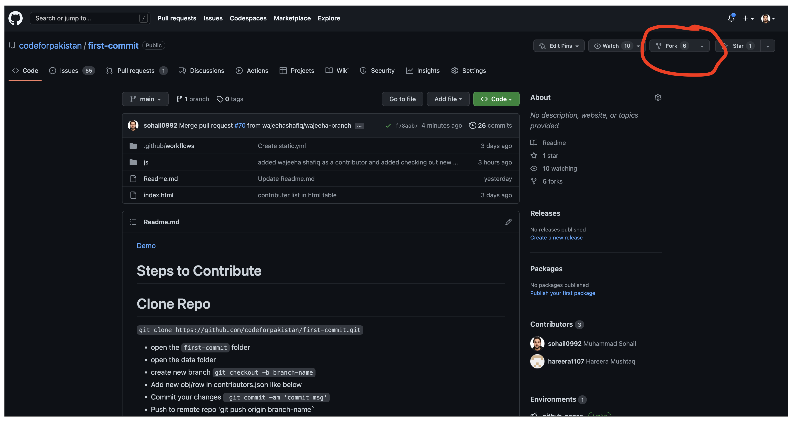
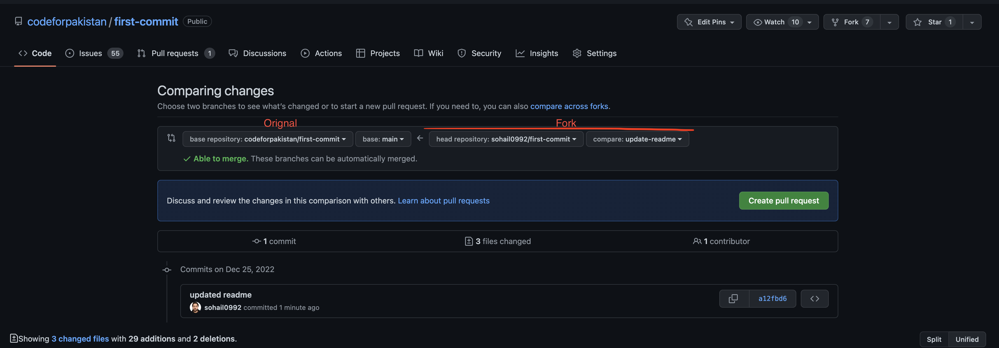

[Demo](https://codeforpakistan.github.io/first-commit/)

# Steps to Contribute

# Create Fork of Repo

 - Open Repo on github `https://github.com/codeforpakistan/first-commit.git`
 - On the top-right corner of the page, click Fork.
 - By default your username is selected in the owner if not select your username and click create fork



# Clone Your Fork

- Fork is basically a copy of that repository created under your username, clone it
- `git clone https://github.com/yourgithub-username/first-commit.git`
- It will create a folder `first-commit`

# Upstream to Orignal Repo

- Open the bash or terminal inside your `first-commit` folder

- Add upstream to orignal repo to sync before doing any new changes to avoid conflicts

- `git remote add upstream https://github.com/codeforpakistan/first-commit.git`


# Verify Upstream

- `git remote -v`


# Fetch and merge main branch from upstream

- `git fetch upstream`
- `git merge upstream/main`

# Add Your Contribution and Push

- open the `first-commit` folder
- open the data folder
- create new branch `git checkout -b branch-name`
- Add new obj/row in contributors.json like below
- Commit your changes ` git commit -am 'commit msg'`
- Push to remote repo 'git push origin branch-name`

```
  {
      "name": "Muhammad Sohail",
      "githubUsername": "sohail0992",
      "site": "https://sohail0992.github.io"
  }
```

# Create a PR from your fork to original repo

- Open your fork repo `https://github.com/yourgithub-username/first-commit.git`
- Click on Pull Requst tab and create PR from your fork/branch to upstream/main branch



## Contributors

<a href="https://github.com/codeforpakistan/first-commit/graphs/contributors">
  
</a>

Made with [contrib.rocks](https://contrib.rocks).
